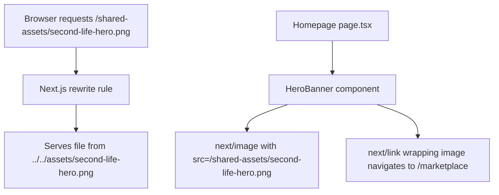
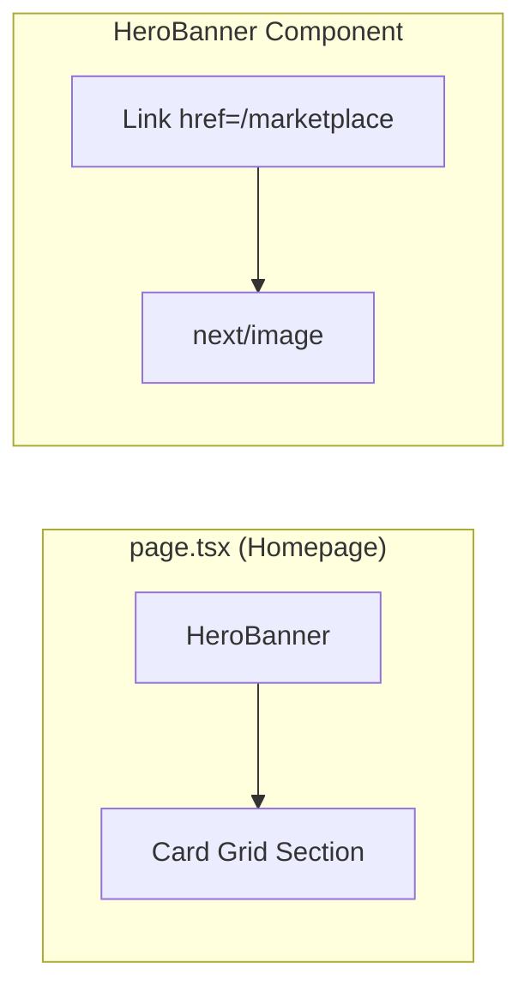

# Design Document: Shared Hero Banner

## Overview

This design replaces the existing hero section on the Buyer App homepage with a single, full-width promotional banner image sourced from a shared asset location at the project root (`secondlife/assets/second-life-hero.png`). The banner acts as a clickable link to `/marketplace` and renders responsively across all supported viewport widths (320px–2560px).

The architecture avoids duplicating the image into `buyer-app/` by configuring Next.js to serve the asset from the monorepo root via a URL rewrite and file-tracing configuration. This enables the same asset to be reused by the Seller App or any other sibling application without file duplication.

## Architecture

### High-Level Flow



### Asset Serving Strategy

The shared asset lives at `secondlife/assets/second-life-hero.png` (project root). The Buyer App at `secondlife/buyer-app/` needs to serve it without copying. The approach:

1. **Next.js `outputFileTracingRoot`** — Set to the monorepo root (`../`) so the production build includes files outside `buyer-app/`.
2. **Custom rewrite** — Map `/shared-assets/:path*` requests to an API route or static handler that reads from the shared `assets/` directory.
3. **Alternative: Symlink at build time** — A build script creates a symlink `buyer-app/public/shared-assets → ../../assets`. This makes the file available at `/shared-assets/second-life-hero.png` via the standard Next.js public folder mechanism.

**Chosen approach: Symlink at build time** — This is the simplest, most compatible solution. A `prebuild` npm script creates a symlink pointing `buyer-app/public/shared-assets` → `../../assets`. The symlink is gitignored. The image is then available at the URL `/shared-assets/second-life-hero.png` with zero runtime overhead, full `next/image` optimization support, and no custom server logic.

> **Rationale:** The symlink approach requires no custom API routes or middleware, works identically in dev and production, and satisfies the requirement that no physical copy of the file exists in `buyer-app/`. A symlink is a filesystem pointer, not a duplicate.

### Component Architecture



- **`HeroBanner`** — A new reusable component at `buyer-app/src/components/HeroBanner.tsx`
- The homepage (`page.tsx`) imports `HeroBanner` and renders it in place of the removed hero section
- The card grid section remains unchanged below

## Components and Interfaces

### HeroBanner Component

**File:** `buyer-app/src/components/HeroBanner.tsx`

```typescript
interface HeroBannerProps {
  /** Image source path (default: /shared-assets/second-life-hero.png) */
  src?: string;
  /** Navigation destination (default: /marketplace) */
  href?: string;
  /** Alt text for accessibility */
  alt?: string;
  /** Aspect ratio width (from source image) */
  aspectWidth?: number;
  /** Aspect ratio height (from source image) */
  aspectHeight?: number;
}
```

**Responsibilities:**
- Renders a full-width clickable banner image
- Uses `next/link` for client-side navigation
- Uses `next/image` for optimized image delivery with responsive sizing
- Reserves vertical space via aspect-ratio to prevent CLS (Cumulative Layout Shift)
- Displays fallback background color on image load failure
- Applies pointer cursor and accessible alt text

**Rendering structure:**
```
<Link href="/marketplace">        ← client-side navigation
  <div style={containerStyles}>   ← full-width, aspect-ratio reserving space
    <Image ... />                 ← next/image with fill + sizes="100vw"
  </div>
</Link>
```

### Modified Homepage (page.tsx)

The existing hero section (lines ~8–120 of `page.tsx`) is removed entirely and replaced with:
```tsx
<HeroBanner />
```

The card grid section below remains unchanged.

### Next.js Configuration Changes

**File:** `buyer-app/next.config.ts`

```typescript
import type { NextConfig } from "next";
import path from "path";

const nextConfig: NextConfig = {
  outputFileTracingRoot: path.join(__dirname, '..'),
  images: {
    formats: ['image/avif', 'image/webp'],
  },
};

export default nextConfig;
```

### Build Script (Symlink Setup)

**File:** `buyer-app/scripts/link-shared-assets.js`

A Node.js script that creates the symlink `public/shared-assets → ../../assets` if it doesn't exist. Added to `package.json` as a `predev` and `prebuild` hook.

### Package.json Changes

```json
{
  "scripts": {
    "predev": "node scripts/link-shared-assets.js",
    "prebuild": "node scripts/link-shared-assets.js",
    "dev": "next dev",
    "build": "next build",
    "start": "next start",
    "lint": "eslint"
  }
}
```

### .gitignore Addition

Add to `buyer-app/.gitignore`:
```
public/shared-assets
```

## Data Models

This feature does not introduce persistent data models. The relevant data structures are:

### Image Metadata (Compile-time)

The banner image dimensions are determined at build time from the static import or from the known aspect ratio of the source image. These values are used to reserve layout space:

| Property | Value | Purpose |
|----------|-------|---------|
| `width` | Source image natural width | Aspect ratio calculation |
| `height` | Source image natural height | Aspect ratio calculation |
| `src` | `/shared-assets/second-life-hero.png` | URL for image loading |
| `alt` | "Browse the Second Life pre-owned marketplace" | Accessibility |

### Layout Constants

| Constant | Value | Source |
|----------|-------|--------|
| Header offset | `98px` | AmazonChrome fixed header (60px + 38px) |
| Hero-to-cards gap | `20px` | Existing spacing from card grid `padding: 20px 16px` |
| Card-to-card gap | `16px` | Existing `gap: 16px` on grid |
| Fallback background | `var(--color-amazon-page-bg)` / `#EAEDED` | Design token |

## Correctness Properties

*A property is a characteristic or behavior that should hold true across all valid executions of a system — essentially, a formal statement about what the system should do. Properties serve as the bridge between human-readable specifications and machine-verifiable correctness guarantees.*

PBT (property-based testing) is **not applicable** to this feature. The shared hero banner is a presentational React component with fixed rendering behavior, CSS layout rules, and build tooling configuration. There are no pure functions with meaningful input variation, no data transformations, and no algorithms where generating hundreds of random inputs would reveal additional bugs beyond example-based tests.

The following structural invariants are verified via example-based tests:

### Property 1: Banner navigation target integrity

For any render of the HeroBanner component, the banner image shall always be wrapped in exactly one anchor element whose href is `/marketplace`, ensuring the navigation destination is never missing or incorrect.

**Validates: Requirements 4.1, 4.3**

### Property 2: Layout shift prevention via aspect-ratio reservation

For any render of the HeroBanner component (whether the image loads successfully or fails), the container shall always have an `aspect-ratio` CSS property set, reserving vertical space and preventing cumulative layout shift.

**Validates: Requirements 2.5, 6.3**

### Property 3: Old hero section removal

For any render of the homepage, zero elements from the previous hero section (text card, product collage grid, overlay badges) shall be present in the rendered DOM.

**Validates: Requirements 1.1, 1.2**

### Property 4: Graceful image failure fallback

For any render of the HeroBanner component where the image fails to load, the container shall display the fallback background color and maintain the same dimensions the banner would occupy if the image loaded successfully.

**Validates: Requirements 6.3**

### Property 5: Shared asset single-source-of-truth

For any build of the Buyer App, the banner image shall be served from the shared asset location (`assets/second-life-hero.png`) and no physical copy of the file shall exist within the `buyer-app/` directory tree.

**Validates: Requirements 6.1, 6.2**

## Error Handling

### Image Load Failure

**Scenario:** The shared asset symlink is broken, the file is missing, or the image fails to decode.

**Handling:**
- The `HeroBanner` component attaches an `onError` handler to the image element
- On error, the container div displays `var(--color-amazon-page-bg)` (`#EAEDED`) as a solid background
- The container maintains the same aspect-ratio dimensions the banner would occupy — preventing layout shift
- The link remains clickable and navigable even when the image fails to load
- No error boundary or crash — graceful degradation only

```typescript
// Pseudocode for error state
const [imageError, setImageError] = useState(false);

<div style={{
  width: '100%',
  aspectRatio: `${aspectWidth} / ${aspectHeight}`,
  background: imageError ? 'var(--color-amazon-page-bg)' : 'transparent',
}}>
  {!imageError && <Image onError={() => setImageError(true)} ... />}
</div>
```

### Symlink Missing (Development)

**Scenario:** A developer clones the repo but doesn't run `npm install` or `npm run dev` (which triggers `predev`).

**Handling:**
- The `link-shared-assets.js` script logs a clear warning if the target `../../assets` directory doesn't exist
- If the symlink target is missing, the script exits gracefully without crashing the build
- The image will return a 404, triggering the component-level fallback above

### Navigation Failure

**Scenario:** The `/marketplace` route doesn't exist or throws an error.

**Handling:**
- Standard Next.js client-side routing handles this — if the route doesn't exist, Next.js shows its 404 page
- No custom error handling needed in the banner component for navigation

## Testing Strategy

### Why Property-Based Testing Does NOT Apply

This feature consists of:
- A **presentational React component** with fixed, predictable rendering
- **Build tooling configuration** (symlinks, next.config)
- **CSS layout behavior** (responsive scaling, aspect ratio)

There are no pure functions with variable inputs, no data transformations, no serialization, and no algorithms to validate across ranges of inputs. All acceptance criteria describe specific DOM structure, CSS properties, or navigation behavior that are best validated with example-based assertions.

### Unit Tests (Component Tests)

Use React Testing Library with Jest/Vitest to test the HeroBanner component in isolation:

| Test | Validates |
|------|-----------|
| Renders an anchor element wrapping an image | Req 4.3 |
| Anchor href points to `/marketplace` | Req 4.1 |
| Image has correct alt text | Req 4.3 |
| Image src contains `second-life-hero` | Req 2.1 |
| Container has `width: 100%` and no margin/padding | Req 2.2 |
| Container has `aspect-ratio` CSS for CLS prevention | Req 2.5 |
| On image error, fallback background renders | Req 6.3 |
| On image error, container maintains dimensions | Req 6.3 |
| Cursor style is pointer | Req 4.2 |

### Integration Tests (Homepage Tests)

Test the full homepage rendering:

| Test | Validates |
|------|-----------|
| Homepage does NOT contain old hero elements (text card, product grid, badges) | Req 1.1, 1.2 |
| Homepage renders HeroBanner component | Req 1.1 |
| Homepage renders all 4 recommendation cards in order | Req 1.3, 5.2 |
| Card grid has correct spacing (20px top, 16px gap) | Req 5.3 |
| Page wrapper has 98px paddingTop for header offset | Req 5.1 |

### Visual Regression Tests (Optional)

If a visual testing tool (e.g., Playwright, Chromatic) is available:

| Test | Validates |
|------|-----------|
| Banner renders full-width at 320px viewport | Req 3.1, 3.2 |
| Banner renders full-width at 1440px viewport | Req 3.1, 3.2 |
| Banner renders full-width at 2560px viewport | Req 3.1, 3.2 |
| No horizontal scrollbar at any tested width | Req 3.2 |
| No image distortion or cropping | Req 3.3 |

### Smoke Tests (Build Verification)

| Test | Validates |
|------|-----------|
| `second-life-hero.png` exists at `assets/second-life-hero.png` | Req 6.1 |
| No file named `second-life-hero.png` exists under `buyer-app/` (excluding symlinks) | Req 6.2 |
| `next.config.ts` includes `outputFileTracingRoot` pointing to parent | Req 6.4 |
| Symlink script creates `public/shared-assets` pointing to `../../assets` | Req 6.4 |

### Test Tools

- **Unit/Integration:** Vitest + React Testing Library (consistent with Next.js ecosystem)
- **Visual:** Playwright (if already in project) or manual QA
- **Smoke:** Node.js `fs` assertions in test suite

